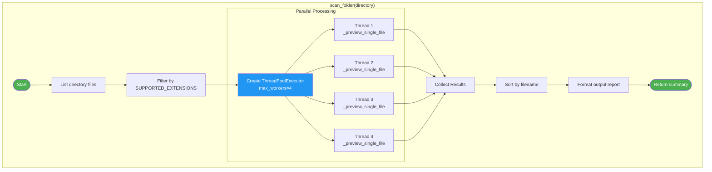

# FsExplorer Architecture Documentation

## Table of Contents

1. [System Overview](#system-overview)
2. [Component Architecture](#component-architecture)
3. [Core Modules](#core-modules)
4. [Workflow Engine](#workflow-engine)
5. [Agent Decision Loop](#agent-decision-loop)
6. [Document Processing Pipeline](#document-processing-pipeline)
7. [Three-Phase Exploration Strategy](#three-phase-exploration-strategy)
8. [Token Tracking & Cost Estimation](#token-tracking--cost-estimation)
9. [CLI Interface](#cli-interface)
10. [Data Flow](#data-flow)
11. [File Structure](#file-structure)
12. [Extension Points](#extension-points)

---

## System Overview

FsExplorer is an AI-powered filesystem exploration agent that answers questions about documents by intelligently navigating directories, parsing files, and synthesizing information with source citations.


---

## Component Architecture

### High-Level Component Diagram


### Module Dependencies


---

## Core Modules

### models.py - Data Schemas

Defines the structured output format for the AI agent using Pydantic models.


### agent.py - AI Agent

The core intelligence component that interacts with Google Gemini.


### fs.py - Filesystem Operations

All filesystem and document parsing utilities.


---

## Workflow Engine

The workflow engine uses an event-driven architecture based on `llama-index-workflows`.

### Workflow State Machine


### Event Types


### Workflow Steps


---

## Agent Decision Loop

### Single Decision Cycle


### Chat History Evolution


---

## Document Processing Pipeline

### Docling Integration


### Caching Strategy

```mermaid
flowchart TB
    subgraph "Cache Key Generation"
        PATH[file_path] --> ABS[os.path.abspath]
        ABS --> MTIME[os.path.getmtime]
        MTIME --> KEY["cache_key = f'{abs_path}:{mtime}'"]
    end

    subgraph "Cache Lookup"
        KEY --> CHECK{Key in cache?}
        CHECK -->|Yes| HIT[Return cached content]
        CHECK -->|No| MISS[Parse with Docling]
        MISS --> STORE[Store in cache]
        STORE --> RETURN[Return content]
    end

    subgraph "_DOCUMENT_CACHE"
        CACHE[(dict: str → str)]
    end

    HIT --> CACHE
    STORE --> CACHE

    style CACHE fill:#ffd93d,color:#000
```



### Parallel Document Scanning



---

## Three-Phase Exploration Strategy

### Phase Overview


### Cross-Reference Detection


---

## Token Tracking & Cost Estimation

### TokenUsage Class

```mermaid
flowchart TB
    subgraph "Input Tracking"
        API[API Call] --> PROMPT[prompt_token_count]
        API --> COMPLETION[candidates_token_count]
        PROMPT --> ADD_API[add_api_call]
        COMPLETION --> ADD_API
    end

    subgraph "Tool Tracking"
        TOOL[Tool Execution] --> RESULT[result string]
        RESULT --> ADD_TOOL[add_tool_result]
        ADD_TOOL --> CHARS[tool_result_chars += len]
        ADD_TOOL --> PARSED{tool_name?}
        PARSED -->|parse_file| INC_PARSED[documents_parsed++]
        PARSED -->|preview_file| INC_PARSED
        PARSED -->|scan_folder| INC_SCANNED[documents_scanned += count]
    end

    subgraph "Cost Calculation"
        ADD_API --> TOTALS[Update totals]
        TOTALS --> CALC[_calculate_cost]
        CALC --> INPUT_COST["input_cost = prompt_tokens × $0.075/1M"]
        CALC --> OUTPUT_COST["output_cost = completion_tokens × $0.30/1M"]
        INPUT_COST --> TOTAL_COST[total_cost]
        OUTPUT_COST --> TOTAL_COST
    end

    subgraph "Summary Output"
        TOTAL_COST --> SUMMARY[summary]
        CHARS --> SUMMARY
        INC_PARSED --> SUMMARY
        INC_SCANNED --> SUMMARY
    end
```



### Cost Estimation Formula

```mermaid
graph LR
    subgraph "Gemini 2.0 Flash Pricing"
        INPUT["Input: $0.075 / 1M tokens"]
        OUTPUT["Output: $0.30 / 1M tokens"]
    end

    subgraph "Calculation"
        PROMPT[prompt_tokens] --> DIV1[÷ 1,000,000]
        DIV1 --> MULT1[× $0.075]
        MULT1 --> INPUT_COST[Input Cost]

        COMP[completion_tokens] --> DIV2[÷ 1,000,000]
        DIV2 --> MULT2[× $0.30]
        MULT2 --> OUTPUT_COST[Output Cost]

        INPUT_COST --> SUM[+]
        OUTPUT_COST --> SUM
        SUM --> TOTAL[Total Estimated Cost]
    end

    style TOTAL fill:#4caf50,color:#fff
```



---

## CLI Interface

### Output Formatting

```mermaid
flowchart TB
    subgraph "Event Handling"
        EVENT{Event Type}
        
        EVENT -->|ToolCallEvent| TOOL_PANEL[format_tool_panel]
        EVENT -->|GoDeeperEvent| NAV_PANEL[format_navigation_panel]
        EVENT -->|AskHumanEvent| HUMAN_PANEL[Human Input Panel]
        EVENT -->|ExplorationEndEvent| FINAL_PANEL[Final Answer Panel]
    end

    subgraph "Tool Panel Components"
        TOOL_PANEL --> ICON[Tool Icon 📂📖👁️🔍]
        TOOL_PANEL --> STEP[Step Number]
        TOOL_PANEL --> PHASE[Phase Label]
        TOOL_PANEL --> TARGET[Target File/Directory]
        TOOL_PANEL --> REASON[Agent's Reasoning]
    end

    subgraph "Final Panel Components"
        FINAL_PANEL --> ANSWER[Answer with Citations]
        FINAL_PANEL --> SOURCES[Sources Consulted]
    end

    subgraph "Summary Panel"
        SUMMARY[Workflow Summary]
        SUMMARY --> STEPS[Total Steps]
        SUMMARY --> CALLS[API Calls]
        SUMMARY --> DOCS[Documents Scanned/Parsed]
        SUMMARY --> TOKENS[Token Usage]
        SUMMARY --> COST[Estimated Cost]
    end

    FINAL_PANEL --> SUMMARY
```



### Visual Elements

```mermaid
graph TB
    subgraph "Panel Styles"
        TOOL["📂 Tool Call<br/>border: yellow"]
        NAV["📁 Navigation<br/>border: magenta"]
        HUMAN["❓ Human Input<br/>border: red"]
        FINAL["✅ Final Answer<br/>border: green"]
        SUMMARY["📊 Summary<br/>border: blue"]
    end

    subgraph "Tool Icons"
        I1["📂 scan_folder"]
        I2["👁️ preview_file"]
        I3["📖 parse_file"]
        I4["📄 read"]
        I5["🔍 grep"]
        I6["🔎 glob"]
    end

    subgraph "Phase Labels"
        PH1["Phase 1: Parallel Document Scan"]
        PH2["Phase 2: Deep Dive"]
        PH3["Phase 1/2: Quick Preview"]
    end

    style TOOL fill:#ffeb3b,color:#000
    style NAV fill:#e1bee7,color:#000
    style HUMAN fill:#ffcdd2,color:#000
    style FINAL fill:#c8e6c9,color:#000
    style SUMMARY fill:#bbdefb,color:#000
```



---

## Data Flow

### Complete Request Flow

```mermaid
sequenceDiagram
    participant User
    participant CLI as main.py
    participant WF as Workflow
    participant Agent as FsExplorerAgent
    participant LLM as Gemini API
    participant Tools as Tool Registry
    participant Docling
    participant Cache
    participant FS as Filesystem

    User->>CLI: uv run explore --task "..."
    CLI->>CLI: print_workflow_header()
    CLI->>WF: workflow.run(InputEvent)

    loop Until StopAction
        WF->>Agent: configure_task()
        Agent->>LLM: generate_content()
        LLM-->>Agent: Action JSON
        Agent->>Agent: Track tokens

        alt ToolCallAction
            Agent->>Tools: TOOLS[name](**args)
            
            alt Document Tool
                Tools->>Cache: Check cache
                alt Cache Hit
                    Cache-->>Tools: Cached content
                else Cache Miss
                    Cache->>Docling: Convert document
                    Docling->>FS: Read file
                    FS-->>Docling: Raw bytes
                    Docling-->>Cache: Markdown content
                    Cache-->>Tools: Content
                end
            else Filesystem Tool
                Tools->>FS: Execute operation
                FS-->>Tools: Result
            end
            
            Tools-->>Agent: Tool result
            Agent->>Agent: Track tool metrics
            WF-->>CLI: ToolCallEvent
            CLI->>CLI: format_tool_panel()
        else GoDeeperAction
            WF->>WF: Update directory state
            WF-->>CLI: GoDeeperEvent
            CLI->>CLI: format_navigation_panel()
        else AskHumanAction
            WF-->>CLI: AskHumanEvent
            CLI->>User: Display question
            User->>CLI: Enter response
            CLI->>WF: HumanAnswerEvent
        else StopAction
            WF-->>CLI: ExplorationEndEvent
        end
    end

    CLI->>CLI: Display final answer
    CLI->>CLI: print_workflow_summary()
    CLI-->>User: Complete output
```

---

## File Structure

```
fs-explorer/
├── src/
│   └── fs_explorer/
│       ├── __init__.py      # Public API exports
│       ├── main.py          # CLI entry point (typer)
│       ├── workflow.py      # Event-driven workflow orchestration
│       ├── agent.py         # AI agent + Gemini integration
│       ├── models.py        # Pydantic action schemas
│       └── fs.py            # Filesystem + Docling operations
├── tests/
│   ├── conftest.py          # Test fixtures and mocks
│   ├── test_agent.py        # Agent unit tests
│   ├── test_fs.py           # Filesystem function tests
│   ├── test_models.py       # Model tests
│   ├── test_e2e.py          # End-to-end integration tests
│   └── testfiles/           # Test data
├── data/
│   ├── large_acquisition/   # Sample PDF documents
│   └── test_acquisition/    # Test document set
├── scripts/
│   ├── generate_test_docs.py
│   └── generate_large_docs.py
├── pyproject.toml           # Project configuration
├── Makefile                 # Development commands
├── README.md                # User documentation
└── ARCHITECTURE.md          # This file
```

---

## Extension Points

### Adding New Tools

```mermaid
flowchart LR
    subgraph "Step 1: Define Function"
        FUNC[def new_tool(args) -> str]
    end

    subgraph "Step 2: Register Tool"
        TOOLS["TOOLS dict in agent.py"]
        FUNC --> TOOLS
    end

    subgraph "Step 3: Update Types"
        TYPES["Tools TypeAlias in models.py"]
        TOOLS --> TYPES
    end

    subgraph "Step 4: Update Prompt"
        PROMPT["SYSTEM_PROMPT in agent.py"]
        TYPES --> PROMPT
    end

    style FUNC fill:#e3f2fd
    style TOOLS fill:#f3e5f5
    style TYPES fill:#fff3e0
    style PROMPT fill:#e8f5e9
```

### Adding New Document Formats

```mermaid
flowchart LR
    subgraph "Docling Supported"
        PDF[PDF] --> DOCLING[Docling]
        DOCX[DOCX] --> DOCLING
        PPTX[PPTX] --> DOCLING
        XLSX[XLSX] --> DOCLING
        HTML[HTML] --> DOCLING
        MD[Markdown] --> DOCLING
    end

    subgraph "To Add New Format"
        NEW[New Format] --> CHECK{Docling<br/>supports?}
        CHECK -->|Yes| ADD["Add to SUPPORTED_EXTENSIONS"]
        CHECK -->|No| CUSTOM["Create custom handler<br/>in fs.py"]
    end

    DOCLING --> OUTPUT[Markdown]
    ADD --> OUTPUT
    CUSTOM --> OUTPUT
```

### Customizing the System Prompt

The system prompt in `agent.py` can be modified to:

1. **Add new exploration strategies**
2. **Change citation format**
3. **Adjust categorization criteria**
4. **Add domain-specific instructions**

```python
SYSTEM_PROMPT = """
# Customize this prompt to change agent behavior

## Your custom instructions here
...
"""
```

---

## Performance Characteristics

| Metric | Typical Value | Notes |
|--------|---------------|-------|
| Parallel scan threads | 4 | Configurable via `DEFAULT_MAX_WORKERS` |
| Preview size | 1500 chars | ~1 page of content |
| Full preview size | 3000 chars | ~2-3 pages |
| Document cache | In-memory | Keyed by path + mtime |
| Workflow timeout | 300 seconds | 5 minutes for complex queries |
| API model | gemini-2.0-flash | Fast, cost-effective |

---

## Security Considerations

1. **API Key**: Stored in environment variable `GOOGLE_API_KEY`
2. **Local Processing**: Documents parsed locally via Docling (no cloud upload)
3. **Filesystem Access**: Limited to current working directory
4. **No Persistent Storage**: Document cache is in-memory only

---

*Last updated: 2026-01-03*
